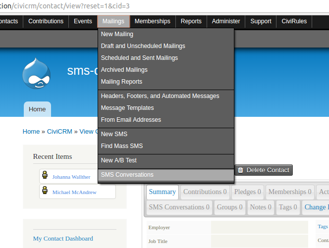
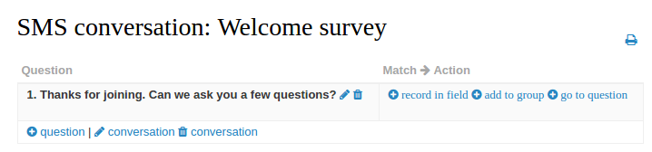
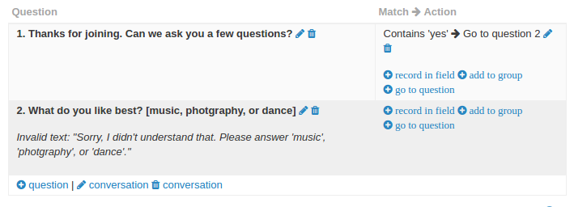
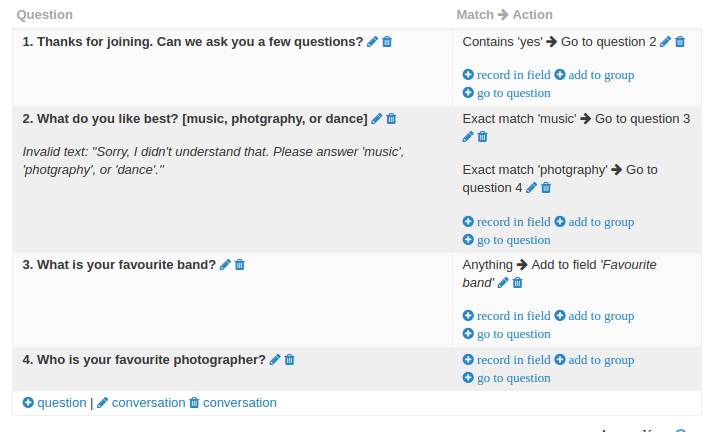

# Create conversations

The first thing to do once you have installed SMS conversation is to define a conversation.

Select **SMS conversations** from the mailing menu to view the conversations screen.

This screen is where you will see all of your defined SMS conversations. Create your first conversation by clicking on **Create a new conversation**.

You will be prompted to name the conversation and enter your first question.

## Questions

Each conversation consist of a series of questions, which are the outbound SMS that are sent to your contacts.  Typically the contact will reply to your question with an answer, and you can carry out various **actions** depending on the answer they give you.

## Actions

Probably the most essential action is to ask another question. In this way you can create a series of questions and answers, thus making up a conversation.

Two other actions are currently available:

* Add to group, which allows you to add the contact to a group
* Record in field, which allows you to record the answer that they have given you in any core or custom contact field.

In the example below, we have created our first question and can now add an action by clicking on a link in the right hand column.

## Matching

Often, you will only want to carry out an action if the answer matches a certain criteria. For example, if you ask the question "Would you like to be added to our newsletter?", then you would only want to add them to the newsletter if the reply was "Yes" (or something similar).

In the example below, we only ask question 2 if the answer to question 1 contains the word 'yes'.

Matching is configured for each action and there are a few different matching types to choose from. Most are self explanatory and documented in the user interface (click on the question marks for more info).

An advanced mode allows you to define a regular expression for the matching. This is useful if you want to configure more sophisticated pattern matching for national ID numbers or post codes or similar.

If no matching action is found for a question, then the Invalid text will be sent.  This is useful, for example, when you are looking for an expected answer and want to repeat the question if you do not receive an answer that you were looking for (see the example above).

## Branching

You may want to ask different questions depending on the answer to the previous question. To do this, you configure multiple 'go to question' actions for a question. In the following example, if someone says that they like music the best, we ask who their favourite band is, and if they say that they like photography the best, we ask who their favourite photograper is. For extra bonus points, we are recording the answer to the favourite band question in a custom field 'Favourite band'.

Note that it is possible for multiple go to questions to match an answer. When multiple matches occur the first encountered match will be processed. You can change the order of the matching by adjusting the weight for an action.
