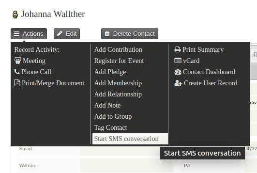
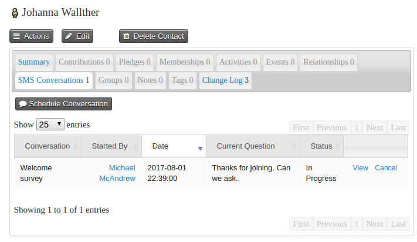

# Start and monitor conversations

There are two ways to start a conversation. Individually from a contact page by selecting the **Start SMS conversation** action.

Or as the result of a search, using the **SMS - schedule a conversation** action.

In both cases you can set the SMS conversation to be started straight away, or at a time in the future.

Once a conversation has been scheduled, you can monitor it on the SMS conversation tab of the contact.

Clicking on view will show you the questions and answers received for the conversation.

If you choose to start a conversation 'straight away' via the search action, the conversation will only actually start when the SMS conversation scheduled job runs.

Only one conversation can be run at any one time. If you request that a new conversation is started with a contact that already has a conversation in progress, the new conversation will only start once the current conversation finishes.

# Contact initiated conversations

You can use CiviRules to start a conversation based on text in an incoming message. This is useful if for example you want to allow contacts to initiate a conversation by texting you a specific keyword "Text Help to 555-1234 to find out how we can help".

To configure a conversation to be user initiated, create a new CiviRule as follows:

* **Select trigger > Activity is added**
* **Add condition > Activity type**: Select inbound SMS
* **Add condition > Activity details**: This should contain the text that you want to trigger the conversation
* **Add condition > Execute only once for activity**: Add this to avoid duplicate conversations being added
* **Add action > scheduled an SMS conversation**: Select the conversation that you want to start.

Note that the action will not attempt to start a conversation if one is already in progress.
